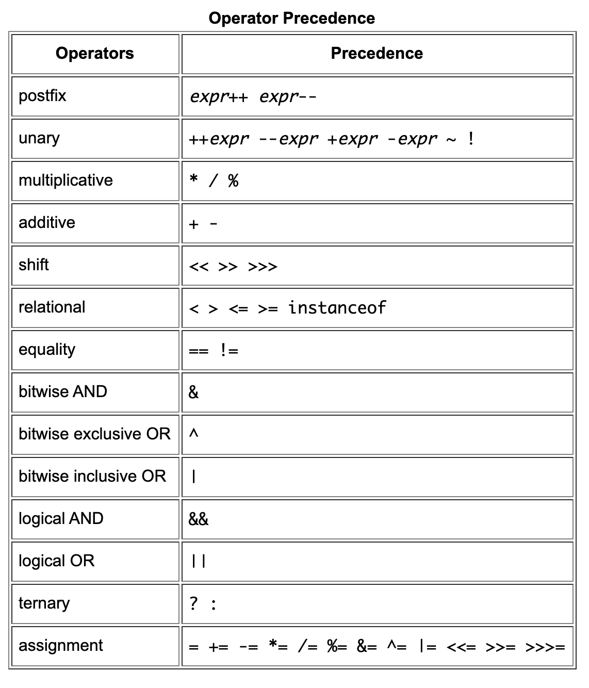

# Java Operators
[Home](./README.md)
  
  

### Type Comparison Operator __Instanceof__
Returns a boolean if the object is an instance of a parent class, extension of a super class and if it implements an Interface.

### Operator rules
1. All binary operators except for the assignment operators are evaluated from left to right; assignment operators are evaluated right to left.  
2. The difference is that the prefix version (++result) evaluates to the incremented value, whereas the postfix version (result++) evaluates to the original value.  

